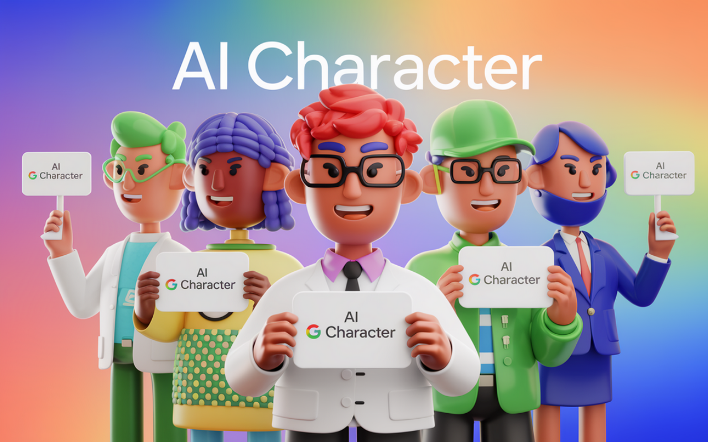
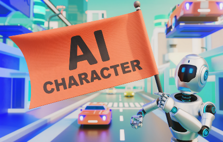
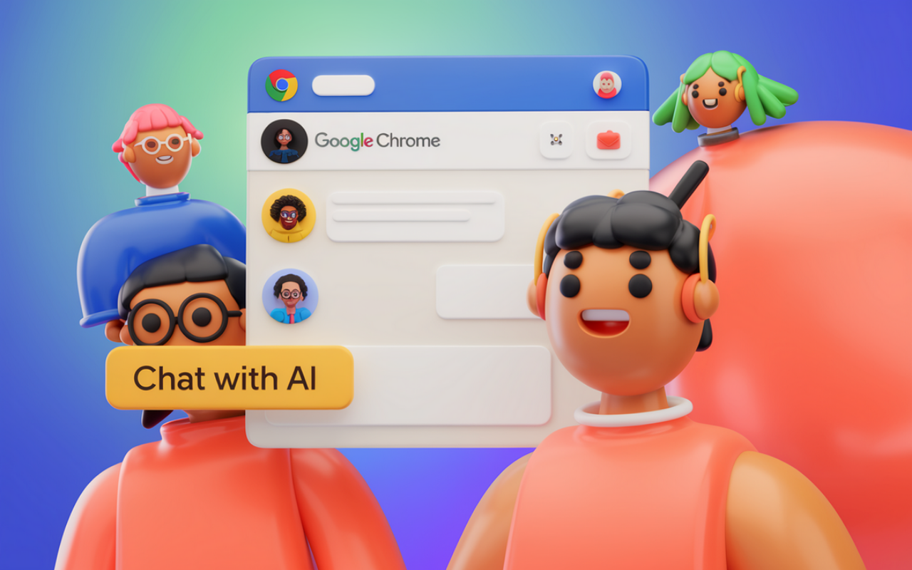
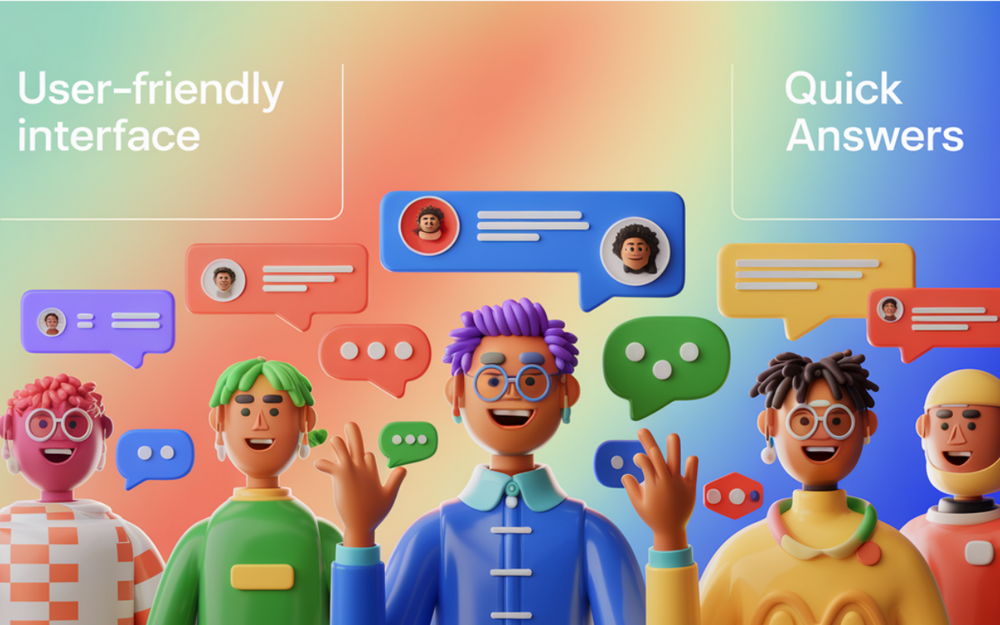

# Character AI

  

A browser extension that enhances your interaction with Character AI, providing instant answers and engaging conversations directly in your browser interface.

  

## Features

- **Personalized Greetings**: Displays customized welcome messages with user's name
- **Category Filtering**: Easy navigation between different conversation types:
  - All
  - Business
  - Creative
  - Education
  - Entertainment
  - Health
  - Lifestyle
  - News
  - Sports
  - Technology
  - Travel
  - Other   

- **Specialized AI Characters**:
  - Corporate Innovation Strategist
  - Business Process Optimization Specialist
  - Business Technology Integration Manager
  - Corporate Sustainability Officer

  

## Interface

- Clean and intuitive user interface
- Dark/Light mode toggle
- Language selection (supports multiple languages)
- Pagination system for browsing different AI characters
- Real-time chat functionality with message input

  

## Additional Features

- Rating system for feedback
- Upgrade option for premium features
- Quick action buttons for enhanced interaction
- Character count display (showing 1-4 from 15 characteristics)

## Installation

[Add installation instructions when ready]

## Usage

1. Install the extension
2. Click on the extension icon in your browser
3. Select the AI character you want to interact with
4. Start your conversation

## Support

cantoweb112@gmail.com

## License

MIT

